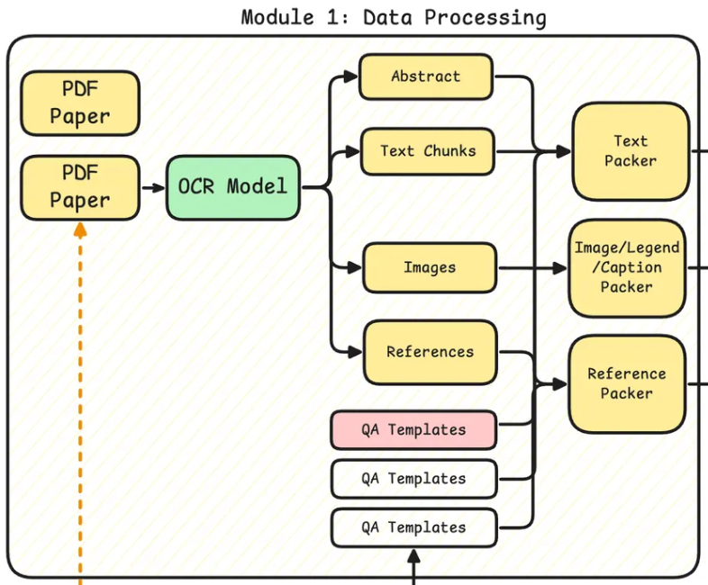

# Ryze-Data

A comprehensive data processing framework for extracting and packaging structured content from PDF papers using OCR and advanced text processing techniques.



## Overview

Ryze-Data is designed to transform PDF documents into multiple structured formats, making academic and technical content more accessible and processable. The framework leverages OCR technology (powered by [marker](https://github.com/datalab-to/marker) and [surya](https://github.com/datalab-to/surya)) to extract text, images, and references from PDF papers, then packages this content into various formats suitable for different use cases.

## 🚀 Key Features

- **Multi-format PDF Processing**: Handles various PDF formats and layouts with high accuracy using state-of-the-art OCR models
- **Intelligent Content Segmentation**: Automatically identifies and separates abstracts, text chunks, images, and references
- **Flexible Output Formats**: Multiple output formats including Markdown, structured JSON, and QA templates
- **Batch Processing**: Efficient processing of multiple documents with GPU acceleration and parallel execution
- **Real-time Progress Tracking**: HTTP status server and incremental CSV logging for monitoring long-running jobs
- **Scalable Architecture**: Supports multi-GPU processing with automatic worker allocation based on GPU memory

## 🏗️ Architecture

The system consists of four main modules:

### Module 1: Data Processing (OCR Model)
- **Input**: PDF files and optional metadata JSON
- **Process**: Uses marker OCR to convert PDFs to Markdown with extracted images
- **Output**: 
  - Markdown files with formatted text
  - Extracted images (PNG format)
  - Processing metadata (JSON)
  - OCR status CSV with success/failure tracking

### Module 2: Content Parser
- **Input**: OCR results from Module 1
- **Process**: Parses Markdown to extract structured components
- **Output**:
  - Abstract content (`paper_abstract.md`)
  - Text chunks (`paper_text_chunks.md`)
  - Image metadata with captions/legends (`paper_images.json`)
  - References (`paper_references.md`)
  - Parsing status CSV

### Module 3: QA Template Manager
- Manages a collection of question-answer templates
- Supports multiple QA types: factual, conceptual, visual, and reference-based
- Extensible template system for custom QA generation

### Module 4: Data Packer and Dataset Generator
- **Input**: Parsed content and QA templates
- **Process**: 
  - Packages structured content
  - Calls LLM APIs for QA pair generation
  - Supports batch inference for efficiency
- **Output**: Generated QA pairs with metadata

## 📋 Requirements

- Python 3.8+
- CUDA-capable GPU (recommended for optimal performance)
- marker OCR package
- Minimum 4GB RAM, 8GB+ recommended for batch processing

## 🛠️ Installation

```bash
# Clone the repository
git clone https://github.com/your-username/ryze-data.git
cd ryze-data

# Install dependencies
pip install -r requirements.txt

# Install marker
pip install marker-pdf
```

## ⚙️ Configuration

Create a `config.json` file based on `config.example.json`:

```json
{
  "ocr": {
    "model": "marker",
    "batch_size": 10,
    "gpu_enabled": true
  },
  "paths": {
    "input_dir": "./input",
    "output_dir": "./output"
  },
  "parsing_model": {
    "provider": "openai",
    "model": "gpt-4",
    "api_key_env": "RYZE_PARSING_API_KEY"
  },
  "qa_generation_model": {
    "provider": "openai", 
    "model": "gpt-4-turbo",
    "api_key_env": "RYZE_QA_API_KEY"
  }
}
```

Set environment variables for API keys:
```bash
export RYZE_PARSING_API_KEY=your-api-key
export RYZE_QA_API_KEY=your-api-key
```

## 🎯 Usage

### Command Line Interface

```bash
# Process PDFs in batch
python src/chunked-ocr.py

# Monitor progress
curl http://localhost:9090/status
```

### Input Structure
```
input/
├── paper1.pdf
├── paper2.pdf
├── paper3.pdf
└── metadata.json (optional)
```

### Output Structure
```
output/
├── paper1/
│   ├── paper1.md
│   ├── paper1_meta.json
│   ├── figure1.png
│   ├── figure2.png
│   └── ...
├── paper2/
│   └── ...
└── ocr_status.csv
```

### Status Monitoring

The system provides real-time status updates via HTTP:

```bash
curl http://localhost:9090/status

{
  "task_name": "chunked_ocr",
  "total_files": 100,
  "completed_files": 45,
  "failed_files": 2,
  "time": "2025-01-18 10:30:45",
  "time_cost": 3421.5,
  "progress_percentage": 47.0
}
```

## 📊 Performance

- **GPU Acceleration**: Automatically detects and utilizes available GPUs
- **Worker Allocation**: Calculates optimal workers based on GPU memory (3.5GB per worker)
- **Batch Processing**: Uses `marker_chunk_convert` for multi-GPU parallel processing
- **Incremental Saving**: Results saved every 50 files to prevent data loss

## 🧪 Use Cases

- **Academic Research**: Digitize and structure research papers for literature reviews
- **Knowledge Extraction**: Build knowledge bases from technical documentation
- **ML Dataset Creation**: Generate training data for NLP and computer vision models
- **Document Analysis**: Extract structured information from legal and technical documents
- **Content Management**: Automate document processing for digital libraries

## 📚 Documentation

- [Design Document](src/README.md) - Detailed technical specifications
- [Configuration Guide](config.example.json) - Configuration options and examples

## 🤝 Contributing

1. Fork the repository
2. Create a feature branch (`git checkout -b feature/amazing-feature`)
3. Commit your changes (`git commit -m 'Add amazing feature'`)
4. Push to the branch (`git push origin feature/amazing-feature`)
5. Open a Pull Request

## 📝 License

This project is licensed under the GNU Affero General Public License v3.0 - see the [LICENSE](LICENSE) file for details.

## 🙏 Acknowledgments

- [marker](https://github.com/datalab-to/marker) team for the excellent PDF to Markdown conversion
- [surya](https://github.com/datalab-to/surya) for OCR capabilities
- Contributors and users who provide feedback and improvements

---

**Made with ❤️ by the Ryze team**