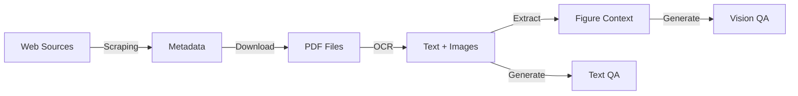

# Ryze-Data

[](https://www.gnu.org/licenses/agpl-3.0)
[](https://www.python.org/downloads/)
[](docs/)

A comprehensive data processing pipeline framework for scientific literature, providing end-to-end workflow from web scraping to training data generation.

[中文文档](docs/zh-CN/README.md) | [English Documentation](docs/)

## Overview

Ryze-Data is an enterprise-grade, modular framework designed to automate the complex process of extracting, processing, and transforming scientific literature into high-quality training datasets for machine learning models.

### Key Features

- **Intelligent Web Scraping**: Automated collection of scientific articles from Nature and other sources
- **Multi-engine OCR**: Extensible OCR with Marker, DeepSeek-OCR v1/v2, MarkItDown, and standalone precompute scripts
- **LLM Request Auto Balancer**: Automatic load balancing across multiple API keys
- **Text QA Generation**: Generate question-answer pairs from OCR markdown files
- **Vision QA Generation**: Generate visual QA pairs from figures (LlamaFactory compatible)
- **Quality Filtering**: Optional LLM-based quality scoring for generated QA pairs
- **Flexible Configuration**: Environment-based configuration with hot-reload support

## Quick Start

### Prerequisites

- Python 3.10 or higher
- [uv](https://docs.astral.sh/uv/) package manager
- CUDA-capable GPU (optional, for accelerated OCR)

### Installation

```bash
# Clone the repository
git clone https://github.com/your-username/ryze-data.git
cd ryze-data

# Install dependencies with uv
uv sync

# Configure environment
cp .env.example .env
# Edit .env to set your API keys
```

### Basic Usage

```bash
# Scrape article metadata from Nature
uv run python -m src.cli.main scrape

# List available OCR models
uv run python -m src.cli.main list-ocr-models

# Run OCR processing (default: marker)
uv run python -m src.cli.main ocr --input-dir data/pdfs --output-dir data/ocr_results

# Run OCR with a specific model
uv run python -m src.cli.main ocr --input-dir data/pdfs --output-dir data/ocr_results --ocr-model deepseek-ocr

# Generate text QA pairs
uv run python -m src.cli.main generate-qa --mode text --qa-ratio 8

# Generate vision QA pairs
uv run python -m src.cli.main generate-qa --mode vision --workers 4

# Generate both with quality filtering
uv run python -m src.cli.main generate-qa --mode both --quality-filter

# Run full pipeline
uv run python -m src.cli.main pipeline --stages scrape,ocr,qa
```

### OCR Precompute (Standalone Scripts)

Each OCR model has an isolated environment under `scripts/utils/`:

```bash
# Setup a model environment
cd scripts/utils/markitdown && bash setup_env.sh

# Run OCR on ArxivQA (5 samples)
.venv/bin/python run_ocr.py --dataset arxivqa --max-samples 5

# Run OCR on SlideVQA (all samples)
.venv/bin/python run_ocr.py --dataset slidevqa

# Marker supports pipelined workers and optional GPU selection
cd ../marker && bash setup_env.sh
.venv/bin/python run_ocr.py --dataset arxivqa --workers 4 --gpu cpu

# DeepSeek models require --gpu
cd ../deepseek_ocr_v1 && bash setup_env.sh
.venv/bin/python run_ocr.py --dataset arxivqa --gpu 0
```

Output goes to `data/ocr_precompute/{model}/{dataset}/`.

### Data Inspection

```bash
# View pipeline status
uv run python -m src.cli.main inspect all

# Inspect specific stage with samples
uv run python -m src.cli.main inspect stage ocr --sample 5 --detailed

# Check configuration
uv run python -m src.cli.main config-show
```

## Project Structure

```
Ryze-Data/
├── src/                       # Source code
│   ├── cli/                   # Command-line interface
│   │   ├── main.py           # CLI entry point
│   │   └── data_inspector.py # Data inspection utilities
│   ├── generators/            # QA generation modules
│   │   ├── __init__.py       # Package exports
│   │   ├── base_generator.py # Abstract base class
│   │   ├── prompt_manager.py # Prompt template loading
│   │   ├── text_qa_generator.py    # Text QA generation
│   │   └── vision_qa_generator.py  # Vision QA generation
│   ├── scrapers/              # Web scraping modules
│   │   └── nature_scraper.py # Nature article scraper
│   ├── api_key_balancer.py    # LLM API key load balancer
│   ├── ocr/                    # Extensible OCR module
│   │   ├── base_ocr.py        # Abstract base class + OCRResult
│   │   ├── deepseek_base.py   # Shared DeepSeek base class
│   │   ├── deepseek_ocr.py    # DeepSeek-OCR v1
│   │   ├── deepseek_ocr_v2.py # DeepSeek-OCR v2
│   │   ├── marker_ocr.py      # Marker OCR (default)
│   │   ├── markitdown_ocr.py  # MarkItDown OCR
│   │   └── registry.py        # OCRRegistry (model discovery)
│   ├── chunked-ocr.py         # Legacy batch OCR processing
│   ├── config_manager.py      # Configuration management
│   └── pipeline_manager.py    # Pipeline orchestration
├── prompts/                   # LLM prompt templates
│   ├── text/                 # Text QA prompts
│   │   ├── factual.txt
│   │   ├── mechanism.txt
│   │   ├── application.txt
│   │   └── quality.txt
│   └── vision/               # Vision QA prompts
│       ├── visual-factual.txt
│       ├── visual-mechanism.txt
│       ├── visual-analysis.txt
│       └── visual-quality.txt
├── tests/                     # Test suite
│   └── test_generators.py    # Generator unit tests
├── docs/                      # Documentation
├── data/                      # Data directories
│   ├── ocr_results/          # OCR markdown output
│   ├── vlm_preprocessing/    # Figure context JSON
│   ├── sft_data/             # Text QA output
│   └── vlm_sft_data/         # Vision QA output
├── scripts/                   # Utility scripts
│   └── utils/                # Standalone OCR precompute
│       ├── _shared/          # Shared dataset loading & image utils
│       ├── deepseek_ocr_v1/  # DeepSeek-OCR v1 standalone
│       ├── deepseek_ocr_v2/  # DeepSeek-OCR v2 standalone
│       ├── marker/           # Marker standalone
│       └── markitdown/       # MarkItDown standalone
├── pyproject.toml            # Project configuration (uv)
└── config.json               # Runtime configuration
```

## Configuration

Ryze-Data uses a multi-layer configuration system:

1. **Default values** (in code)
2. **Configuration file** (config.json)
3. **Environment variables** (.env)
4. **Command-line arguments**

### Quick Configuration

```bash
# Essential environment variables
OPENAI_API_KEY=sk-...           # For QA generation
RYZE_DATA_ROOT=./data           # Data storage location
RYZE_NUM_WORKERS=4              # Parallel processing threads
```

See [Configuration Guide](docs/configuration.md) for detailed options.

## Pipeline Architecture



Each stage is:
- **Independent**: Can be run separately
- **Resumable**: Supports checkpoint recovery
- **Scalable**: Supports distributed processing

See [Architecture Documentation](docs/architecture.md) for details.

## Output Formats

### Text QA (`data/sft_data/{paper_id}_qa.jsonl`)
```json
{"question": "...", "answer": "...", "paper_id": "...", "section": "section_0", "difficulty": "easy", "question_type": "factual"}
```

### Vision QA (`data/vlm_sft_data/{paper_id}_vision_qa.jsonl`)
```json
{"messages": [{"role": "user", "content": "Question <image>"}, {"role": "assistant", "content": "Answer"}], "images": ["path/to/figure.jpeg"], "metadata": {...}}
```

See [Data Formats](docs/data-formats.md) for complete specifications.

## Testing

```bash
# Run all tests
uv run pytest

# Run with coverage
uv run pytest --cov=src --cov-report=html

# Run generator tests
uv run pytest tests/test_generators.py -v
```

## Documentation

- [Architecture Design](docs/architecture.md) - System architecture and design decisions
- [Configuration Guide](docs/configuration.md) - Detailed configuration options
- [API Reference](docs/api-reference.md) - Complete API documentation
- [Data Formats](docs/data-formats.md) - Data structure specifications
- [Development Guide](docs/development.md) - Contributing and extending
- [Troubleshooting](docs/troubleshooting.md) - Common issues and solutions

## Development

```bash
# Install with dev dependencies
uv sync --all-extras

# Run formatters
uv run black src/ tests/
uv run ruff check --fix src/ tests/

# Run type checking
uv run mypy src/
```

## License

This project is licensed under the GNU Affero General Public License v3.0 - see the [LICENSE](LICENSE) file for details.

## Acknowledgments

- [Marker](https://github.com/datalab-to/marker) - OCR engine
- [DeepSeek-OCR](https://huggingface.co/deepseek-ai/DeepSeek-OCR) - Vision-based OCR models
- [MarkItDown](https://github.com/microsoft/markitdown) - Microsoft PDF-to-Markdown conversion
- [OpenAI](https://openai.com) - LLM APIs
- [LlamaFactory](https://github.com/hiyouga/LLaMA-Factory) - Training framework compatibility
