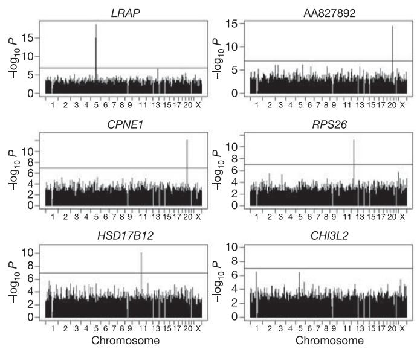
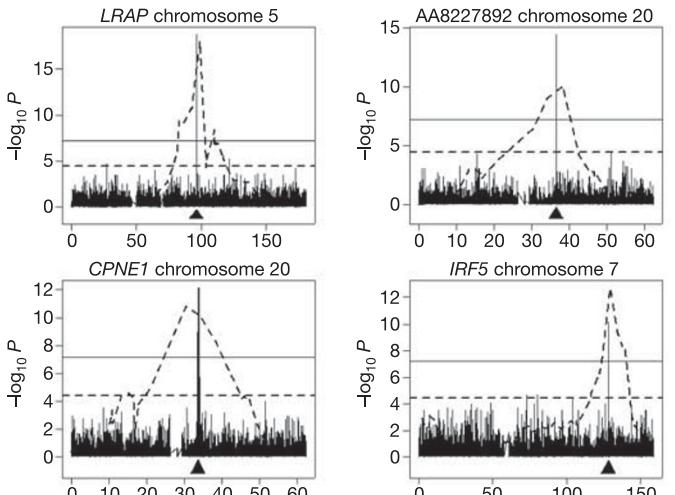
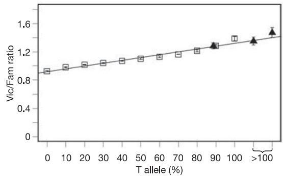

## LETTERS

## Mapping determinants of human gene expression by regional and genome-wide association

Vivian G. Cheung1,2,3, Richard S. Spielman2 , Kathryn G. Ewens2 , Teresa M. Weber2,3, Michael Morley3 & Joshua T. Burdick3

To study the genetic basis of natural variation in gene expression, we previously carried out genome-wide linkage analysis and mapped the determinants of ,1,000 expression phenotypes1 . In the present study, we carried out association analysis with dense sets of single-nucleotide polymorphism (SNP) markers from the International HapMap Project2 . For 374 phenotypes, the association study was performed with markers only from regions with strong linkage evidence; these regions all mapped close to the expressed gene. For a subset of 27 phenotypes, analysis of genomewide association was performed with *>*770,000 markers. The association analysis with markers under the linkage peaks confirmed the linkage results and narrowed the candidate regulatory regions for many phenotypes with strong linkage evidence. The genome-wide association analysis yielded highly significant results that point to the same locations as the genome scans for about 50% of the phenotypes. For one candidate determinant, we carried out functional analyses and confirmed the variation in cis-acting regulatory activity. Our findings suggest that association studies with dense SNP maps will identify susceptibility loci or other determinants for some complex traits or diseases.

The expression level of genes, 'the expression phenotype'3 , is highly variable and heritable in humans4,5 and other organisms6 . We previously1 performed genome-wide linkage analysis for 3,554 expression phenotypes in 14 pedigrees from the Utah component of the Centre d'Etude du Polymorphisme Humain (CEPH) to map the genetic determinants of variation in human gene expression. For ,1,000 expression phenotypes, significant linkage evidence was obtained, suggesting the existence of determinants that act in cis or trans to the expressed gene. In the present study, we used genotype data generated by the International HapMap Project2 to test for allelic association in two sets of analyses. First, for a set of 374 phenotypes with evidence of cis-linked determinants, we performed association analysis with dense sets of SNPs near linkage peaks. Second, we restricted attention to the 27 phenotypes with the strongest linkage evidence for cis-acting determinants, and tested .770,000 SNPs in the genome for association. Because all the phenotypes have been mapped previously by genetic linkage, the analyses allow us to compare directly the results from whole-genome linkage and association studies.

The 374 phenotypes have at least one marker with linkage evidence (t . 2) for cis regulators1 ; this corresponds to a point-wise P , 0.02 with the sample of 14 CEPH sibships. For the present analysis, we obtained SNP genotype data on 57 unrelated CEPH individuals from the International HapMap Project2 and generated expression phenotypes using the Affymetrix Human Genome Focus arrays.

Evidence for linkage requires co-segregation between the phenotype and a marker site, but does not depend on the particular allele present at the marker. In contrast, allelic association with a linked marker requires correlation with a particular SNP allele; that is, linkage disequilibrium. Even if there are several different alleles at the determinant ('allelic heterogeneity'), linkage can be detected. But if there is allelic heterogeneity, it is less likely that there will be detectable association. Therefore, it was not obvious that evidence for linkage would predict evidence for association. So, for a set of phenotypes with cis linkage, we performed association analysis with SNPs within the target genes and within 50 kilobases (kb) of the 50 and 30 ends, and compared results with those from the previous linkage scans1 . The evidence for association was assessed by linear regression. Among the 374 phenotypes, there are 65 (17%) with at least one marker that shows evidence of association at the nominal P , 0.001 level. For some of the phenotypes, the association with a nearby marker is extremely strong; among the 65 phenotypes, there are 12 with evidence of cis association at P , 10210. At the less stringent threshold of P , 0.01 for association, there are 133 (36%) phenotypes. We also determined the proportion of phenotypes with these two nominal levels of evidence for cis association for various strengths of initial linkage findings (Supplementary Table 1). We found that the strength of linkage evidence did tend to predict association results. For example, among the 27 phenotypes with highly significant cis linkage (t . 5, P , 3.7 £ 1025 ), 70% have evidence of cis association at P , 0.001, compared to only 9% of the phenotypes with modest evidence of cis linkage (2 , t , 3, P , 0.02).

Although there are many examples of regulatory sites located in 50 or 30 flanking regions of genes, little is known about the relative frequencies. Although the marker most strongly associated with gene expression level is not necessarily the functional variant, we expect that in most cases that marker will be very close to the functional variant. With this assumption, we determined the location of the markers within 50 kb of the target genes that showed the strongest association, to establish whether they occur preferentially in the 50 or 30 regions. Among the 133 phenotypes with cis association at P , 0.01, the regulatory sites are found in approximately the same proportions in the 50 (27%) and 30 (34%) ends, and within the target genes (25%). For 14% of the phenotypes, linkage disequilibrium among SNPs spanning the regions examined was so strong that we were not able to narrow the regions of cis association. Thus, overall we found that cis regulators are not preferentially enriched in the 50 or 30 regions around the target genes. However, for most of the phenotypes, the analysis of regional association data narrowed the search for the regulatory determinants to one particular region near the target gene.

The analyses described so far were restricted to the SNPs known to be located in regions near the target genes. If we did not know in advance where to look for determinants, how successfully would we

1 Department of Pediatrics and 2 Department of Genetics, University of Pennsylvania, 3 The Children's Hospital of Philadelphia, Philadelphia, Pennsylvania 19104, USA.

|  | Table 1   Genome-wide association results for 27 phenotypes |  |  |  |  |  |
|--|-------------------------------------------------------------|--|--|--|--|--|
|--|-------------------------------------------------------------|--|--|--|--|--|

| Phenotype       | Location of target gene | Linkage results               | GWA results (for peak marker) |                |                  |  |
|-----------------|-------------------------|-------------------------------|-------------------------------|----------------|------------------|--|
|                 |                         | Peak marker P-value (all cis) | Marker                        | Location*      | Nominal P-value† |  |
| LRAP (LOC64167) | 5q15                    | 1 £ 1027                      | rs2762                        | 58,030         | 1.98 £ 10219     |  |
| AA827892        | 20q11.23                | 3 £ 1028                      | rs788350                      | 2666           | 3.67 £ 10215     |  |
| PSPHL           | 7p11.2                  | 3 £ 10211                     | rs6593279                     | 236,903        | 9.59 £ 10215     |  |
| CPNE1           | 20q11.22                | 1 £ 1027                      | rs6060535                     | 17,327‡        | 8.35 £ 10213     |  |
| CSTB            | 21q22.3                 | 2 £ 1029                      | rs880987                      | 228,195        | 2.48 £ 10212     |  |
| RPS26           | 12q13.2                 | 2 £ 1029                      | rs2271194                     | 241,768        | 7.94 £ 10212     |  |
| GSTM2           | 1p13.3                  | 3 £ 1028                      | rs535088                      | 12,699         | 2.00 £ 10211     |  |
| HLA-DRB2        | 6p21.32                 | ,10211                        | rs6928482                     | 8,345          | 6.51 £ 10211     |  |
| IRF5            | 7q32.1                  | 2 £ 1028                      | rs2280714                     | 16,731         | 6.78 £ 10211     |  |
| HSD17B12        | 11p11.2                 | 2 £ 10211                     | rs4755741                     | 100,949‡       | 7.38 £ 10211     |  |
| GSTM1           | 1p13.3                  | 1 £ 1027                      | rs535088                      | 27,052         | 8.33 £ 10210     |  |
| PPAT            | 4q12                    | 2 £ 1027                      | rs227940                      | Trans (Chr 7)  | 5.29 £ 1029      |  |
| PPAT            | 4q12                    | 2 £ 1027                      | rs2139512                     | 25,227‡        | 2.87 £ 1028      |  |
| DDX17           | 22q13.1                 | 6 £ 10210                     | rs10490570                    | Trans (Chr 2)  | 7.13 £ 1029      |  |
| CTSH            | 15q25.1                 | 7 £ 1029                      | rs1369324                     | 22,298         | 2.17 £ 1028      |  |
| POMZP3          | 7q11.23                 | 9 £ 10210                     | rs1754162                     | 26,215         | 7.23 £ 1028      |  |
| CGI-96          | 22q13.2                 | 3 £ 1029                      | rs9600337                     | Trans (Chr 13) | 2.43 £ 1027      |  |
| CHI3L2          | 1p13.3                  | 3 £ 10211                     | rs755467                      | 291            | 2.57 £ 1027      |  |
| VAMP8           | 2p11.2                  | 9 £ 1028                      | rs10509846                    | Trans (Chr 10) | 5.31 £ 1027      |  |
| EIF3S8          | 16p11.2                 | 4 £ 1028                      | rs8092794                     | Trans (Chr 18) | 7.20 £ 1027      |  |
| TM7SF3          | 12p11.23                | ,10211                        | rs11822822                    | Trans (Chr 11) | 7.32 £ 1027      |  |
| IL16            | 15q25.1                 | 3 £ 10210                     | rs6957902                     | Trans (Chr 7)  | 9.63 £ 1027      |  |
| TCEA1           | 8q11.23                 | 6 £ 1028                      | rs6562160                     | Trans (Chr 13) | 1.08 £ 1026      |  |
| S100A13         | 1q21.3                  | 3 £ 1028                      | rs3757791                     | Trans (Chr 7)  | 1.40 £ 1026      |  |
| ICAP-1A         | 2p25.1                  | ,10211                        | rs10807387                    | Trans (Chr 6)  | 2.27 £ 1026      |  |
| SMARCB1         | 22q11.23                | 4 £ 1027                      | rs7802273                     | Trans (Chr 7)  | 2.46 £ 1026      |  |
| CTBP1           | 4p16.3                  | 2 £ 1029                      | rs1060043                     | Trans (Chr 19) | 5.26 £ 1026      |  |
| ZNF85           | 19p12                   | 9 £ 1029                      | rs2168903                     | Trans (Chr 12) | 6.51 £ 1026      |  |

\*Relative to transcriptional start site of target gene. When the most significant marker is located on a chromosome different from the target gene, it is listed as 'Trans' and the chromosome is shown.

.

†Corrected P-value of 0.05 corresponds to a nominal P-value of 6.7 £ 1028

‡Marker is within genomic extent of target gene.

find them? To answer this question, we took advantage of the hundreds of thousands of markers across the genome, genotyped on the same 57 unrelated CEPH individuals as above. Instead of focusing on cis regulatory regions, we performed genome-wide association analysis (GWA) to map determinants. We limited our analysis to the 27 phenotypes with the strongest evidence of cis regulation from our whole-genome linkage analysis1 so that the results could be compared with the linkage results in which we have highest confidence. We tested 770,394 SNP markers for association with each expression phenotype and performed a regression analysis of expression level on marker genotype. We used the Sˇida´k procedure, which is conservative7 , to correct for multiple testing.

The evidence for association was significant at the genome-wide level (nominal P , 6.7 £ 1028 or corrected P , 0.05) for 14 of the 27 phenotypes (Table 1). Figure 1 shows several examples. The GWA identified only cis regulation for 12 of the phenotypes, cis and trans regulation for another phenotype (phosphoribosyl pyrophosphate aminotransferase (PPAT)), and only trans regulation for one phenotype (DEAD box polypeptide 17 (DDX17)).

We compared the findings for the 27 phenotypes in Table 1 to those from our previous whole-genome linkage scans1 . To simplify this analysis, we focused on the SNP with the most significant finding in the GWA for each phenotype in Table 1. For this SNP, we classified the results according to whether the association was or was not supported by the genome-wide linkage analysis (that is, whether the SNP that showed significant association fell within the region of significant linkage). For 15 of the 27 phenotypes, genome-wide linkage analyses and GWA pointed to the same cis regulatory regions. In 13 of these, the corrected P-value for the cis marker was ,0.05 (Puncorr. , 6.7 £ 1028 ) in the GWA, providing highly significant evidence for cis regulatory elements. In one of the 13 phenotypes, PPAT, the GWA result points to both cis and trans regulators; however, linkage scan results support only the cis regulation. For the other two phenotypes (POMZP3 and CHI3L2) the results were nominally significant (P ¼ 7 £ 1028 and P ¼ 3 £ 1027 , respectively). For both phenotypes, the peak SNPs are located close to the target genes (6 kb 50 for POMZP3 and 91 base pairs (bp) 50 for CHI3L2). Because of the location, we consider these cases 'true' positives, but recognize that the statistical evidence alone is not compelling. We show evidence below that one of these peak SNPs is a regulatory variant of CHI3L2.

For the remaining 12 of the 27 phenotypes, no strong evidence for

Figure 1 | Results of genome-wide association analysis for six representative phenotypes with cis regulators. The horizontal line in each panel corresponds to P ¼ 0.05 after Sˇida´k correction.

cis determinants was found by GWA. In 11 of the 12 phenotypes, no significant association (Pcorr. , 0.05 or Puncorr. , 6.7 £ 1028 ) was detected anywhere in the genome, even though highly significant evidence for cis regulation was detected in the linkage scans. For DDX17, as indicated above, GWA identified significant trans association (Pcorr. , 0.05) but evidence for a trans-acting regulator was not found in the linkage scan. For all 12 phenotypes, the most significant markers were located on chromosomes different from that of the expressed gene. (There are 13 'trans' markers listed in Table 1; one is the non-cis marker for PPAT, see above.) The locations and P-values from the association analyses for these markers are shown in Table 1. In some cases, the failure to find significant evidence for cis association, despite highly significant linkage results for cis regulation, may be due to linkage findings that were false-positive results. However, even if the linkage findings reflect real effects, allelic heterogeneity might make the determinant undetectable by association. Furthermore, our sample size of 57 might be too small to yield statistically significant associations, especially if the marker closest to a determinant is not in strong linkage disequilibrium with it.

To assess the issue of sample size for this and future studies, we determined the power to detect association—with the same correction we used for multiple testing—under various assumptions about sample size. We also considered variation in effect size; that is, the proportion (R2 ) of phenotype variation accounted for by the SNP. As a point of reference, the observed values of R2 for the 13 phenotypes with significant cis association range from 0.44 to 0.78. (In classical complex traits and diseases, R2 for individual determinants is expected to be much smaller.) To achieve a probability of 0.8 of detecting a determinant for which R2 is 0.1, we found that samples of ,500 would be needed (see Supplementary Information). Even these results must be viewed as optimistic; the calculations apply to an idealized determinant that is identical to the marker in both location and frequency, yielding maximum linkage disequilibrium. Furthermore, it is difficult to extrapolate the results to complex traits in general. For many quantitative traits of interest, the fraction of phenotypic variance attributable to any one determinant is likely to be far smaller than the values we estimated for the 13 strongly associated cis-linked expression phenotypes. Thus, extrapolations from the small samples used here to genome-wide analysis with other

Figure 2 | Results of genome-wide linkage analysis (dotted line) superimposed on those from genome-wide association (bars) for the chromosome where the expressed gene is located. The location of the expressed gene is indicated by an arrow. The dotted horizontal line is for data from linkage scans and corresponds to t ¼ 4, P ¼ 3.7 £ 1025 . The solid horizontal line is for data from GWA and corresponds to P ¼ 0.05 after S ˇida´k correction. The x axis indicates chromosome location in megabases.

complex traits should be done cautiously—much larger samples will usually be required.

We expected that the much greater resolution afforded by linkage disequilibrium would result in candidate regions defined by association that are much smaller than those defined by linkage. For all 15 phenotypes where the linkage and GWA results are concordant, this expectation was confirmed. Figure 2 shows several examples. For example, in the GWA for CPNE1, the 30 markers with significant evidence of association (Pcorr. , 0.05) span a region of only 402 kb. For IRF5, the ten significant markers span 90 kb of chromosome 7. For four phenotypes (RPS26, GSTM1, GSTM2 and DDX17), there is only one significant marker.

Ultimately, the findings from linkage and association need to be confirmed by functional analysis. Results from our genome-wide linkage and association analyses suggest that expression level of chitinase 3-like 2 (CHI3L2) is regulated by a cis-acting transcriptional regulator (Table 1). A marker (rs755467) in the promoter region of CHI3L2 shows nominally significant association results (P , 3 £ 1027 ). Although it is not significant after correction for 770,394 markers, we considered it likely that expression level of CHI3L2 is indeed regulated by a polymorphism in its promoter region, because both linkage and association results point to the same candidate regulatory region. We followed up this finding with functional tests. To evaluate the relative promoter activity of the haplotypes bearing the different alleles of the SNP marker rs755467, we performed luciferase reporter assays. Stronger luciferase expression (.3-fold) was observed for vectors containing the upstream fragment than for the empty vector, confirming promoter activity in the DNA fragment containing marker rs755467. We then compared the promoter activity of the fragment bearing the rs755467 T-allele with that bearing the G-allele. The promoter activity of the fragment bearing the rs755467 T-allele was 2 *^* 0.6-fold higher (P , 0.05) than that bearing the G-allele.

Next, we performed haplotype-specific chromatin immunoprecipitation (haploChIP) to determine whether this observation is due to differential binding of RNA polymerase II to the different haplotypes8,9. The assay was performed using lymphoblastoid cells from three CEPH individuals heterozygous at rs755467. We used antibody against RNA polymerase II (phosphorylated serine 5), which is known to accumulate in promoter regions of genes10. We quantified the relative abundance of the RNA polymerase II binding to the haplotypes bearing the T- or G-alleles in each of the

Figure 3 | HaploChIP assay with RNA polymerase II antibody to estimate allele-specific binding. Open squares show fluorescence intensities (Vic/Fam ratios) of genomic DNA samples with experimentally varied proportions of allele T at SNP rs755467. The linear regression line is shown. Solid triangles show mean fluorescence intensities of immunoprecipitated products from three individuals heterozygous at rs755467. In all three cases, the immunoprecipitated products contained more T than G in the DNA. Estimates greater than 100% for the T-allele imply that no G-allele-bearing DNA fragments were detected in the immunoprecipitated products. Standard deviation of triplicate measurements is shown.

heterozygous individuals by quantitative polymerase chain reaction (PCR)9 . In all three cases, we found that in immunoprecipitated DNA, the amount of DNA bearing the T-allele of rs755467 is much higher than that bearing the G-allele (\$90% T and 10% G) (Fig. 3). This result suggests that the higher expression of CHI3L2 in individuals who are TT homozygotes for rs755467 is due to stronger binding of RNA polymerase II to DNA containing the T-allele than to that containing the G-allele. Thus, results from both functional assays support data from the association analysis and suggest that the polymorphism rs755467 or a marker in strong linkage disequilibrium with it is a determinant that affects the expression level of CHI3L2.

The results of this study have implications for studies of many phenotypes besides gene expression. It has become a truism that finding genes that contribute to complex traits and diseases is much more difficult than finding genes for mendelian traits, and the underlying problems have been discussed in many reviews11–14. As genomic resources have become available, increasing attention has been given to the role of association analysis, first described systematically in ref. 15. Here we have carried out association analysis with dense SNP maps in two settings that parallel approaches used to map genes for human diseases and traits. First, we performed regional association analysis with SNP markers in and around target genes to identify cis-acting regulatory variants. This approach parallels candidate gene studies. Second, we analysed .770,000 SNP markers to identify determinants of variation in gene expression by GWA analysis. This parallels studies where no candidate regions are specified in advance, and association analysis is used to find susceptibility genes. The GWA analysis, carried out with only 57 unrelated individuals, yielded highly significant results for 14 of the 27 phenotypes. The evidence for association was so strong in these cases that the findings remained significant (Pcorr. , 0.05) even after correction for the large number of tests genome-wide.

The use of GWA to find genes is controversial12,16,17. The optimism inspired by the availability of very dense SNP maps has been tempered by the resulting problems of multiple testing. There have been a few genome-wide association studies18–20; however, the marker density in those studies was much lower than that made possible here by the International HapMap Project. Despite the small sample size, we obtained significant findings for approximately 50% of the 27 phenotypes analysed by genome-wide association analysis. The results suggest that as denser marker maps become available and high-throughput genotyping technologies are developed, large-scale association studies will become a practical means to identify genes for complex traits and diseases.

## METHODS

CEPH samples and expression phenotyping. The data were from 57 CEPH individuals. These correspond to all the unrelated individuals in the CEPH HapMap collection except for three individuals (GM12264, GM11840, GM12056), because their cell lines were not available at the time of this study. For expression analysis, RNA was extracted from lymphoblastoid cells from each individual and hybridized onto Affymetrix Human Genome Focus arrays following the manufacturer's protocol. Expression intensity was scaled to 500 using Affymetrix Microarray Suite 5.0 program and log2 transformed.

Genotypes. SNP genotypes were downloaded from the International HapMap database (http://www.hapmap.org) (release 14). For data analysis, 770,394 markers were used; this excludes markers that are monomorphic or genotypes missing in all the 57 subjects. Locations of the SNP markers are based on those of the human reference sequence (http://genome.ucsc.edu) of May 2004 (hg 17, build 35).

Association analysis. For the association analysis, log2-transformed expression level of the 57 individuals as a dependent variable was regressed on SNP genotype (coded 0, 1, 2). R2 was estimated for each phenotype/genotype combination as the ratio of the regression sum of squares to total sum of squares.

For the association analysis with SNPs near and within the target genes, we have not used multiple-testing correction for the P-values (0.001 and 0.01) used as thresholds. Our goal is not to show that these are significant themselves, but to compare the evidence from association and linkage analyses. The number of markers examined per phenotype varied depending on the genomic extent of the target gene. The median size of the target genes is 24 kb (mean ¼ 45 kb). The average marker density in the version (release 14) of the HapMap data that we obtained is about 1 per 5 kb. Because the target genes vary in size, on average more markers were tested for the larger target genes. However, the genes with cis association were not significantly larger (P . 0.5) than those without cis association.

For the GWA, correction for multiple testing was performed by the Sˇida´k procedure for the 770,394 tests7 . The corrected P-value of 0.05 corresponds to a nominal P-value of 6.7 £ 1028 .

Power. The power of the association analysis for one SNP was estimated in two ways. First we carried out analyses on simulated data. We fixed total phenotypic variance ( ¼ 1, for convenience), and considered a range of values for R2 . For each R2 , we calculated corresponding differences between genotype means for the three SNP genotypes (assuming no dominance). Individual simulated phenotype values were obtained from each of three normal distributions, in numbers drawn from Hardy–Weinberg proportions, to reach the desired total sample size (60, 100, etc). The process was repeated 500 times, and standard linear regression analysis was done. The proportion of outcomes with P-value ,0.05/770,000 was taken as the power. Second, this procedure was checked by comparing results with those from a published equivalent21.

Luciferase reporter assay. PCR was performed to generate fragments upstream of CHI3L2 (21,115 bp to þ391 bp relative to transcription start site with forward primer 50 -ACGGAACGCGTTGCAAGTCCATTCTCACAGG-30 and reverse primer 50 -ACGGACTCGAGGACTCGCAATACAACGCTCA-30 ). Genomic DNA from individuals homozygous at SNP marker rs755467 was used: GM12003 (GG), GM12236 (GG), GM12814 (TT) and GM10846 (TT). The amplicons were inserted into firefly luciferase reporter plasmids, pGL3 enhancer vectors (Promega). The clones were confirmed by sequencing. Two individuals of each genotype were examined as technical replicates. The pGL-enhancer reporter plasmids were co-transfected with pRL-TK Renilla control plasmids into lymphoblastoid cells (3 million cells per reaction) using Solution V (Amaxa) by electroporation (Program T15) following the manufacturer's recommendation (Amaxa). The cells were incubated for 24 h before lysis. Luciferase activity was read using a luminometer (Veritas) and normalized to the intensity of pRL-TK and reported as relative luciferase activity. All assays were performed with six replicates.

Quantitative HaploChIP. Chromatin immunoprecipitation was carried out in a similar manner as previously described (ref. 22; see also http://genomics. ucdavis.edu/farnham/protocols/chips.html). Cell lysates were sonicated (ten times for 10 s) using a Branson Ultrasonic Sonicator, resulting in DNA fragments with an average length of ,500 bp. Lymphoblastoid cells (20 £ 106 cells per reaction) from individuals (GM07000, GM07029 and GM10847) heterozygous at SNP marker rs755467, and antibody against 5Ser-P RNA polymerase II (clone H14, Covance), were used.

Allele-specific quantification of the immunoprecipitated product was carried out as previously described9 with Taqman primers for rs755467 (Applied Biosystems) using an ABI PRISM 7000. A standard curve for the quantitative PCR was produced with genomic DNA mixtures with varying amounts of DNA from two individuals that were homozygous at marker rs755467 (GM12814, TT; GM11829, GG). Using the standard curve, genomic DNA from two individuals (GM07029, GM10847) heterozygous at rs755467 was found to contain ,50% of T- and 50% of G-alleles as expected (reporter dye Vic (allele T) to reporter dye Fam (allele G) (Vic/Fam) ratio ¼ 1.07). The standard curve was then used to quantify the ratio of T:G alleles in the immunoprecipitated DNA.

## Received 30 June; accepted 19 September 2005.

- 1. Morley, M. et al. Genetic analysis of genome-wide variation in human gene expression. Nature 430, 743–-747 (2004).
- 2. International HapMap Consortium. The International HapMap Project. Nature 426, 789–-796 (2003).
- 3. Cheung, V. G. & Spielman, R. S. The genetics of variation in gene expression. Nature Genet. 32, 522–-525 (2002).
- 4. Cheung, V. G. et al. Natural variation in human gene expression assessed in lymphoblastoid cells. Nature Genet. 33, 422–-425 (2003).
- 5. Monks, S. A. et al. Genetic inheritance of gene expression in human cell lines. Am. J. Hum. Genet. 75, 1094–-1105 (2004).
- 6. Brem, R. B., Yvert, G., Clinton, R. & Kruglyak, L. Genetic dissection of
- transcriptional regulation in budding yeast. Science 296, 752–-755 (2002).
- 7. Westfall, P. H. & Young, S. S. Resampling-Based Multiple Testing (John Wiley & Sons, New York, 1992).
- 8. Knight, J. C., Keating, B. J., Rockett, K. A. & Kwiatkowski, D. P. In vivo characterization of regulatory polymorphisms by allele-specific quantification of RNA polymerase loading. Nature Genet. 33, 469–-475 (2003).
- 9. Liu, X. et al. Expression-based discovery of variation in the human glutathione S-transferase M3 promoter and functional analysis in a glioma cell line using allele-specific chromatin immunoprecipitation. Cancer Res. 65, 99–-104 (2005).
- 10. Komarnitsky, P., Cho, E. J. & Buratowski, S. Different phosphorylated forms of RNA polymerase II and associated mRNA processing factors during transcription. Genes Dev. 14, 2452–-2460 (2000).
- 11. Lander, E. S. & Schork, N. J. Genetic dissection of complex traits. Science 265, 2037–-2048 (1994).
- 12. Wang, W. Y., Barratt, B. J., Clayton, D. G. & Todd, J. A. Genome-wide association studies: theoretical and practical concerns. Nature Rev. Genet. 6, 109–-118 (2005).
- 13. Glazier, A. M., Nadeau, J. H. & Aitman, T. J. Finding genes that underlie complex traits. Science 298, 2345–-2349 (2002).
- 14. Botstein, D. & Risch, N. Discovering genotypes underlying human phenotypes: past successes for mendelian disease, future approaches for complex disease. Nature Genet. 33, 228–-237 (2003).
- 15. Risch, N. & Merikangas, K. The future of genetic studies of complex human diseases. Science 273, 1516–-1517 (1996).
- 16. Carlson, C. S., Eberle, M. A., Kruglyak, L. & Nickerson, D. A. Mapping complex disease loci in whole-genome association studies. Nature 429, 446–-452 (2004).
- 17. Hirschhorn, J. N. & Daly, M. J. Genome-wide association studies for common diseases and complex traits. Nature Rev. Genet. 6, 95–-108 (2005).
- 18. Carrasquillo, M. M. et al. Genome-wide association study and mouse model identify interaction between RET and EDNRB pathways in Hirschsprung disease. Nature Genet. 32, 237–-244 (2002).
- 19. Ozaki, K. et al. Functional SNPs in the lymphotoxin-alpha gene that are associated with susceptibility to myocardial infarction. Nature Genet. 32, 650–-654 (2002).
- 20. Klein, R. J. et al. Complement factor H polymorphism in age-related macular degeneration. Science 308, 385–-389 (2005).
- 21. Ball, R. D. Experimental designs for reliable detection of linkage disequilibrium in unstructured random population association studies. Genetics 170, 859–-873 (2005).
- 22. Oberley, M. J., Tsao, J., Yau, P. & Farnham, P. J. High-throughput screening of chromatin immunoprecipitates using CpG-island microarrays. Methods Enzymol. 376, 315–-334 (2004).

Supplementary Information is linked to the online version of the paper at www.nature.com/nature.

Acknowledgements We thank W. J. Ewens, H. H. Kazazian and D. Bell for discussions and advice. This work is supported by grants from the National Institutes of Health (to R.S.S. and V.G.C.) and the W.W. Smith Endowed Chair (to V.G.C.).

Author Information The GEO accession number for the microarray data is GSE2552. Reprints and permissions information is available at npg.nature.com/ reprintsandpermissions. The authors declare no competing financial interests. Correspondence and requests for materials should be addressed to V.G.C. (vcheung@mail.med.upenn.edu) or R.S.S. (spielman@pobox.upenn.edu).