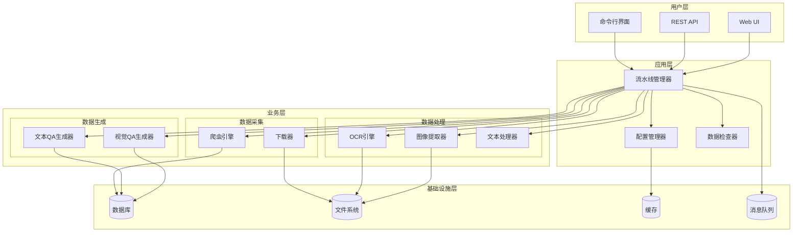
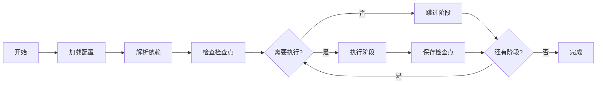
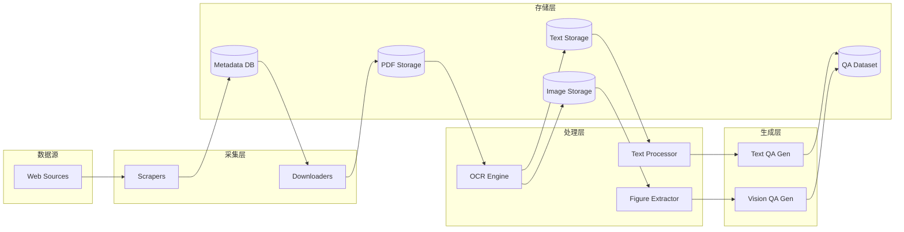

# Ryze-Data 架构设计文档

## 目录

- [系统概述](#系统概述)
- [架构原则](#架构原则)
- [系统架构](#系统架构)
- [核心模块](#核心模块)
- [数据流设计](#数据流设计)
- [技术栈](#技术栈)
- [扩展性设计](#扩展性设计)
- [性能优化](#性能优化)
- [监控和日志](#监控和日志)
- [安全性考虑](#安全性考虑)
- [未来规划](#未来规划)

## 系统概述

Ryze-Data 是一个模块化、可扩展的科学文献处理框架，采用流水线架构设计，将复杂的文献处理任务分解为独立的处理阶段。系统专注于从科学期刊（如 Nature）爬取文献，通过 OCR 技术提取内容，并生成高质量的机器学习训练数据。

### 设计目标

1. **模块化（Modularity）**：各组件独立开发、测试和部署
2. **可扩展性（Scalability）**：易于添加新的数据源和处理步骤
3. **高效性（Efficiency）**：支持并行处理和分布式执行
4. **可靠性（Reliability）**：错误恢复和断点续传机制
5. **可观测性（Observability）**：完整的日志和监控支持

### 系统特性

- **智能爬虫系统**：支持多种科学文献源
- **高性能 OCR**：GPU 加速的文档处理
- **上下文感知**：保留图表与文本的关联关系
- **质量控制**：多层次的数据验证机制
- **灵活配置**：环境驱动的配置管理

## 架构原则

### 1. 单一职责原则（Single Responsibility）

每个模块负责一个明确的功能：
- **Scraper**：数据爬取和元数据收集 ✅
- **APIBalancer**：API 密钥负载均衡 ✅
- **OCR**：文档 OCR 处理 ✅

```python
# 示例：每个类只负责一个职责
class NatureScraper:
    """只负责 Nature 网站的爬取"""
    def scrape(self): pass

class OpenAIAPIBalancer:
    """只负责 API 密钥的负载均衡"""
    def submit_request(self): pass

class ConfigManager:
    """只负责配置管理"""
    def load(self): pass
```

### 2. 依赖倒置原则（Dependency Inversion）

- 核心业务逻辑不依赖具体实现
- 通过接口和抽象类定义契约
- 配置驱动的依赖注入

```python
from abc import ABC, abstractmethod

class BaseScraper(ABC):
    """抽象接口，不依赖具体实现"""
    @abstractmethod
    def scrape(self) -> List[Dict]:
        pass

class ScraperFactory:
    """工厂类管理依赖注入"""
    def create_scraper(self, source: str) -> BaseScraper:
        if source == "nature":
            return NatureScraper()
        elif source == "arxiv":
            return ArxivScraper()
```

### 3. 开闭原则（Open-Closed）

- 对扩展开放：易于添加新的处理器
- 对修改关闭：核心流程稳定不变

```python
# 核心流程不变
class Pipeline:
    def run(self):
        for stage in self.stages:
            stage.execute()

# 通过添加新类扩展功能
class NewProcessor(BaseProcessor):
    def execute(self):
        # 新功能实现
        pass
```

## 项目结构

```
Ryze-Data/
├── .env.example                 # 环境变量模板
├── .env.test                    # 测试环境配置
├── config.example.json          # 配置模板（支持环境变量）
├── config.test.json             # 测试配置
├── requirements.txt             # Python依赖
├── pytest.ini                   # Pytest配置
├── run_tests.py                 # 测试运行脚本
├── README.md                    # 项目文档
├── LICENSE                      # AGPL-3.0许可证
│
├── src/                         # 源代码目录
│   ├── __init__.py
│   ├── config_manager.py        # ✅ 配置管理（支持环境变量扩展）
│   ├── pipeline_manager.py      # ⚠️ 流水线框架（部分实现）
│   ├── api_key_balancer.py      # ✅ OpenAI API 密钥负载均衡器
│   ├── chunked-ocr.py           # ✅ 分块 OCR 处理
│   │
│   ├── cli/                     # 命令行界面
│   │   ├── __init__.py
│   │   ├── main.py             # ✅ CLI主入口
│   │   └── data_inspector.py   # ✅ 数据检查和采样工具
│   │
│   └── scrapers/               # 数据源爬虫
│       ├── __init__.py
│       ├── base_scraper.py     # 基础爬虫接口
│       └── nature_scraper.py   # ✅ Nature文章爬虫
│
├── tests/                      # 测试套件
│   ├── __init__.py
│   ├── conftest.py            # 测试夹具和配置
│   ├── README.md              # 测试文档
│   │
│   ├── unit/                  # 单元测试
│   │   ├── __init__.py
│   │   ├── test_config_manager.py
│   │   └── test_data_inspector.py
│   │
│   ├── integration/           # 集成测试
│   │   ├── __init__.py
│   │   └── test_pipeline.py
│   │
│   └── fixtures/              # 测试数据
│       ├── sample.pdf
│       ├── sample_metadata.csv
│       └── mock_responses.json
│
├── docs/                      # 文档
│   ├── architecture.md        # 架构设计文档
│   ├── api-reference.md       # API文档
│   ├── configuration.md       # 配置指南
│   ├── data-formats.md        # 数据格式规范
│   ├── development.md         # 开发指南
│   ├── troubleshooting.md     # 故障排除指南
│   │
│   └── zh-CN/                # 中文文档
│       ├── README.md         # 中文项目说明
│       ├── architecture.md   # 架构设计文档
│       ├── configuration.md  # 配置指南
│       └── development.md    # 开发指南
│
├── prompts/                   # LLM提示词模板
│   ├── text_qa_prompt.txt    # 文本QA生成提示词
│   └── vision_qa_prompt.txt  # 视觉QA生成提示词
│
├── scripts/                   # 脚本工具
│   └── utils/                # 独立 OCR 预处理脚本
│       ├── _shared/          # 共享工具（数据集加载、图像转 PDF）
│       ├── deepseek_ocr_v1/  # DeepSeek-OCR v1 独立脚本
│       ├── deepseek_ocr_v2/  # DeepSeek-OCR v2 独立脚本
│       ├── marker/           # Marker 独立脚本
│       └── markitdown/       # MarkItDown 独立脚本
│
├── data/                      # 数据目录（git忽略）
│   ├── nature_metadata/       # 爬取的元数据
│   ├── pdfs/                 # 下载的PDF文件
│   ├── ocr_results/          # OCR处理结果
│   ├── ocr_precompute/       # 独立脚本 OCR 输出
│   ├── figures/              # 提取的图表（📋 计划中）
│   ├── sft_data/             # 文本QA训练数据（📋 计划中）
│   └── vlm_sft_data/         # 视觉QA训练数据（📋 计划中）
│
└── data-sample/              # 测试用样本数据
    ├── nature_metadata/
    │   └── sample.csv
    ├── pdfs/
    │   └── sample.pdf
    └── ocr_results/
        └── sample/
            ├── sample.md
            └── sample_meta.json
```

### 实现状态

| 模块 | 状态 | 说明 |
|------|------|------|
| ConfigManager | ✅ 已实现 | 完整的配置管理，支持环境变量 |
| OpenAIAPIBalancer | ✅ 已实现 | 多 API 密钥负载均衡 |
| Chunked OCR | ✅ 已实现 | 分块 OCR 处理 |
| NatureScraper | ✅ 已实现 | Nature 文章爬取 |
| DataInspector | ✅ 已实现 | 数据检查工具 |
| PipelineManager | ⚠️ 框架 | 流水线框架已实现，具体阶段需扩展 |
| PDFDownloader | 📋 计划中 | PDF 下载功能 |
| FigureExtractor | 📋 计划中 | 图表提取功能 |
| TextQAGenerator | 📋 计划中 | 文本 QA 生成 |
| VisionQAGenerator | 📋 计划中 | 视觉 QA 生成 |

### 文件用途说明

| 文件/目录 | 用途 | 状态 |
|-----------|------|------|
| `.env.example` | 环境配置模板 | ✅ |
| `config.example.json` | 配置文件模板 | ✅ |
| `src/config_manager.py` | 统一配置管理 | ✅ |
| `src/pipeline_manager.py` | 流水线编排逻辑 | ⚠️ |
| `src/api_key_balancer.py` | API 密钥负载均衡 | ✅ |
| `src/chunked-ocr.py` | 分块 OCR 处理 | ✅ |
| `src/cli/main.py` | CLI 命令实现 | ✅ |
| `src/cli/data_inspector.py` | 数据检查工具 | ✅ |
| `src/scrapers/` | 网页爬取模块 | ✅ |
| `tests/` | 完整测试套件 | ✅ |
| `docs/` | 技术文档 | ✅ |
| `prompts/` | LLM 提示词模板 | ✅ |
| `data/` | 运行时数据存储 | ✅ |

## 系统架构

### 整体架构图



### 分层架构

```
┌─────────────────────────────────────────────────────────┐
│                    表示层（Presentation）                 │
│                  CLI / REST API / Web UI                 │
└─────────────────┬───────────────────────────────────────┘
                  │
┌─────────────────▼───────────────────────────────────────┐
│                    应用层（Application）                  │
│              Pipeline Manager / Orchestrator             │
│  ┌──────────────────────────────────────────────────┐   │
│  │ • 阶段编排（Stage Orchestration）                  │   │
│  │ • 依赖解析（Dependency Resolution）               │   │
│  │ • 错误处理（Error Handling）                      │   │
│  │ • 状态管理（State Management）                    │   │
│  └──────────────────────────────────────────────────┘   │
└─────────┬──────────┬──────────┬──────────┬────────────┘
          │          │          │          │
┌─────────▼────┐ ┌──▼───┐ ┌───▼────┐ ┌───▼────┐
│   业务层     │ │ Down │ │Process │ │ Gener  │
│  Scrapers   │ │loader│ │  ors   │ │ ators  │
└─────┬────┘ └──┬───┘ └───┬────┘ └───┬────┘
          │          │          │          │
┌─────────▼──────────▼──────────▼──────────▼────┐
│           基础设施层（Infrastructure）           │
│         Configuration / Storage / Cache         │
└──────────────────────────────────────────────────┘
```

## 核心模块

### 1. CLI 接口（`src/cli/`）

**职责**：提供用户交互接口

**主要组件**：
- `main.py`：命令行入口和命令路由
- `data_inspector.py`：数据检查和采样工具

**设计模式**：
- Command Pattern：命令封装和执行
- Factory Pattern：动态命令创建

**实现示例**：
```python
@click.group()
@click.pass_context
def cli(ctx):
    """主命令组"""
    ctx.ensure_object(dict)
    ctx.obj['config'] = ConfigManager()

@cli.command()
@click.option('--workers', '-w', default=4)
def scrape(workers):
    """爬取命令"""
    scraper = ScraperFactory.create()
    scraper.run(workers=workers)
```

### 2. 流水线管理器（`src/pipeline_manager.py`）

**职责**：协调和管理处理流水线

**核心功能**：
- 阶段注册和管理
- 依赖关系解析
- 执行流程控制
- 错误恢复机制
- 检查点管理

**架构设计**：
```python
class PipelineManager:
    def __init__(self, config: ConfigManager):
        self.stages = {}  # 阶段注册表
        self.execution_order = []  # 执行顺序
        self.checkpoints = {}  # 检查点
    
    def add_stage(self, stage: PipelineStage):
        """动态注册新阶段"""
        self.stages[stage.name] = stage
        self._rebuild_execution_order()
    
    def run(self, stages: List[str] = None):
        """执行指定阶段，支持断点续传"""
        for stage_name in self._get_execution_order(stages):
            if self._should_skip(stage_name):
                continue
            
            try:
                self._execute_stage(stage_name)
                self._save_checkpoint(stage_name)
            except Exception as e:
                self._handle_error(stage_name, e)
    
    def _resolve_dependencies(self):
        """使用拓扑排序解析依赖"""
        # 实现 DAG 拓扑排序
        pass
```

**执行流程**：


### 3. 配置管理器（`src/config_manager.py`）

**职责**：统一配置管理

**分层配置策略**：
1. **默认配置**（代码中定义）
2. **文件配置**（config.json）
3. **环境变量**（.env）
4. **运行时参数**（CLI args）

**配置优先级**（从高到低）：
```
CLI参数 > 环境变量 > 配置文件 > 默认值
```

**热加载支持**：
```python
class ConfigManager:
    def __init__(self):
        self._watchers = []
        self._config_cache = {}
    
    def load(self, config_path: str = "config.json"):
        """加载配置并设置文件监控"""
        self._load_defaults()
        self._load_file(config_path)
        self._load_env()
        self._setup_watcher(config_path)
    
    def reload(self):
        """热重载配置"""
        self._invalidate_cache()
        self.load(self.config_path)
        self._notify_watchers()
```

### 4. 爬虫模块（`src/scrapers/`）

**职责**：数据源爬取和元数据收集

**扩展接口**：
```python
class BaseScraper(ABC):
    def __init__(self, config: dict):
        self.config = config
        self.session = self._create_session()
    
    @abstractmethod
    def scrape(self) -> Generator[ArticleMetadata, None, None]:
        """爬取文章，返回生成器以支持流式处理"""
        pass
    
    def _create_session(self):
        """创建带重试机制的会话"""
        session = requests.Session()
        retry_strategy = Retry(
            total=3,
            backoff_factor=1,
            status_forcelist=[429, 500, 502, 503, 504]
        )
        adapter = HTTPAdapter(max_retries=retry_strategy)
        session.mount("https://", adapter)
        return session
```

**已实现的爬虫**：
- `NatureScraper`：Nature 期刊爬虫
- 计划支持：ArXiv、PubMed、IEEE Xplore

### 5. API 密钥负载均衡器（`src/api_key_balancer.py`）✅

**职责**：管理多个 OpenAI API 密钥，实现负载均衡和自动重试

**核心功能**：
- 多 API 密钥轮询
- 自动失败重试和回退
- 请求队列管理
- 统计和监控

**架构设计**：
```python
class OpenAIAPIBalancer:
    def __init__(self, api_keys: List[str], num_workers: int = 4):
        self.api_keys = api_keys
        self.workers = []
        self.request_queue = Queue()
        self.result_dict = {}

    def submit_request(self, request_type: str, **kwargs) -> str:
        """提交请求到队列"""
        request_id = str(uuid.uuid4())
        request = APIRequest(request_id, request_type, kwargs)
        self.request_queue.put(request)
        return request_id

    def get_result(self, request_id: str, timeout: float = None):
        """获取请求结果"""
        # 等待并返回结果
        pass

    def get_statistics(self) -> dict:
        """获取请求统计信息"""
        return {
            "total_requests": self.total_requests,
            "successful_requests": self.successful_requests,
            "failed_requests": self.failed_requests,
            "average_latency": self.average_latency
        }
```

**支持的请求类型**：
- `chat_completion`：聊天补全请求
- `embedding`：嵌入向量请求

### 6. 处理器模块（📋 计划中）

> 以下模块为计划中的功能，尚未完全实现。

**计划的处理器类型**：

| 处理器 | 功能 | 输入 | 输出 | 状态 |
|-------|------|------|------|------|
| `OCRProcessor` | 文本提取 | PDF | Markdown + 图片 | ✅ 已实现（chunked-ocr.py）|
| `FigureExtractor` | 图片提取 | OCR结果 | 图片 + 上下文 | 📋 计划中 |
| `TableExtractor` | 表格提取 | OCR结果 | 结构化表格 | 📋 计划中 |

### 7. 生成器模块（📋 计划中）

> 以下模块为计划中的功能，尚未实现。

**计划的生成器类型**：
- `TextQAGenerator`：基于文本的问答生成 📋
- `VisionQAGenerator`：基于图像的问答生成 📋
- `MultiModalQAGenerator`：多模态问答生成 📋

## 数据流设计

### 1. 数据流向图



### 2. 数据格式转换流程

| 阶段 | 输入格式 | 处理 | 输出格式 | 示例 |
|------|---------|------|----------|------|
| 爬取 | HTML | 解析提取 | CSV/JSON | metadata.csv |
| 下载 | URLs | HTTP下载 | PDF | paper.pdf |
| OCR | PDF | 文本提取 | Markdown + JPEG | paper.md + figures/ |
| 处理 | Markdown | 结构化解析 | JSON | paper_structured.json |
| 生成 | JSON | LLM处理 | JSONL | qa_pairs.jsonl |

### 3. 数据存储策略

**分层存储架构**：

```
data/
├── raw/                    # 原始数据（冷存储）
│   ├── pdfs/              # 原始PDF文件
│   └── metadata/          # 爬取的元数据
├── processed/             # 处理后数据（温存储）
│   ├── ocr_results/       # OCR结果
│   ├── figures/           # 提取的图片
│   └── abstracts/         # 摘要文本
├── generated/             # 生成数据（热存储）
│   ├── sft_data/         # 文本QA数据
│   └── vlm_sft_data/     # 视觉QA数据
└── cache/                # 缓存（内存/SSD）
    └── temp/             # 临时文件
```

**存储优化策略**：
- **压缩**：对历史数据进行压缩存储
- **分片**：大文件分片存储和并行读取
- **索引**：建立文件索引加速查询
- **清理**：定期清理过期临时文件

## 技术栈

### 核心技术

| 组件 | 技术选型 | 版本 | 说明 |
|------|---------|------|------|
| 语言 | Python | 3.8+ | 主开发语言 |
| CLI | Click | 8.0+ | 命令行框架 |
| 配置 | python-dotenv | 1.0+ | 环境变量管理 |
| OCR | Marker | latest | PDF转换引擎 |
| 爬虫 | BeautifulSoup | 4.9+ | HTML解析 |
| HTTP | Requests | 2.28+ | 网络请求 |
| 并行 | multiprocessing | - | 多进程处理 |
| 异步 | asyncio | - | 异步IO |
| 测试 | pytest | 7.0+ | 测试框架 |
| 日志 | logging | - | 标准日志库 |

### 外部依赖

| 服务 | 用途 | 必需性 | 替代方案 |
|------|------|--------|----------|
| OpenAI API | QA生成 | 必需 | 本地LLM |
| GPU | OCR加速 | 可选 | CPU处理 |
| Redis | 任务队列 | 可选 | 内存队列 |
| S3/OSS | 数据存储 | 可选 | 本地存储 |
| PostgreSQL | 元数据 | 可选 | SQLite |

## 扩展性设计

### 1. 插件架构

支持通过插件扩展功能：

```python
# 插件接口定义
class Plugin(ABC):
    @abstractmethod
    def initialize(self, config: dict):
        """初始化插件"""
        pass
    
    @abstractmethod
    def execute(self, context: dict) -> dict:
        """执行插件逻辑"""
        pass
    
    @abstractmethod
    def cleanup(self):
        """清理资源"""
        pass

# 插件管理器
class PluginManager:
    def __init__(self):
        self.plugins = {}
    
    def register(self, name: str, plugin_class: Type[Plugin]):
        """注册插件"""
        self.plugins[name] = plugin_class
    
    def load_plugin(self, name: str, config: dict) -> Plugin:
        """加载并初始化插件"""
        plugin_class = self.plugins.get(name)
        if not plugin_class:
            raise ValueError(f"Plugin {name} not found")
        
        plugin = plugin_class()
        plugin.initialize(config)
        return plugin
```

### 2. 自定义处理器

添加新的处理器示例：

```python
# custom_processor.py
from src.processors.base_processor import BaseProcessor

class CustomProcessor(BaseProcessor):
    """自定义处理器实现"""
    
    def process(self, input_data: Any) -> Any:
        # 自定义处理逻辑
        processed = self.transform(input_data)
        validated = self.validate(processed)
        return validated
    
    def transform(self, data):
        # 数据转换
        pass
    
    def validate(self, data):
        # 数据验证
        pass

# 注册到流水线
pipeline.add_stage(
    name='custom_processing',
    processor=CustomProcessor(),
    dependencies=['ocr'],
    priority=5
)
```

### 3. 数据源扩展

支持新数据源的步骤：

1. **实现爬虫类**
```python
class ArxivScraper(BaseScraper):
    def scrape(self):
        # Arxiv特定的爬取逻辑
        pass
```

2. **注册爬虫**
```python
ScraperRegistry.register('arxiv', ArxivScraper)
```

3. **配置数据源**
```json
{
  "scrapers": {
    "arxiv": {
      "enabled": true,
      "base_url": "https://arxiv.org",
      "rate_limit": 1.0
    }
  }
}
```

### 4. 输出格式扩展

自定义输出格式：

```python
class CustomFormatter(BaseFormatter):
    def format(self, data: Any) -> str:
        """自定义格式化逻辑"""
        if self.config.format == "custom_json":
            return self.format_json(data)
        elif self.config.format == "custom_xml":
            return self.format_xml(data)
        else:
            raise ValueError(f"Unsupported format: {self.config.format}")
```

## 性能优化

### 1. 并行处理策略

**多层次并行**：
- **进程级并行**：CPU密集型任务（OCR、图像处理）
- **线程级并行**：I/O密集型任务（网络请求、文件读写）
- **异步处理**：大量并发请求（API调用）

```python
# 混合并行策略
class HybridProcessor:
    def __init__(self):
        self.process_pool = ProcessPoolExecutor(max_workers=cpu_count())
        self.thread_pool = ThreadPoolExecutor(max_workers=20)
        self.loop = asyncio.get_event_loop()
    
    def process_cpu_intensive(self, tasks):
        """CPU密集型任务使用进程池"""
        futures = [self.process_pool.submit(task) for task in tasks]
        return [f.result() for f in futures]
    
    def process_io_intensive(self, tasks):
        """I/O密集型任务使用线程池"""
        futures = [self.thread_pool.submit(task) for task in tasks]
        return [f.result() for f in futures]
    
    async def process_async(self, tasks):
        """异步任务使用asyncio"""
        return await asyncio.gather(*tasks)
```

### 2. 缓存策略

**多级缓存**：
```python
class CacheManager:
    def __init__(self):
        self.memory_cache = {}  # L1: 内存缓存
        self.disk_cache = DiskCache()  # L2: 磁盘缓存
        self.redis_cache = RedisCache()  # L3: 分布式缓存
    
    def get(self, key: str):
        # 逐级查找
        if key in self.memory_cache:
            return self.memory_cache[key]
        
        if value := self.disk_cache.get(key):
            self.memory_cache[key] = value
            return value
        
        if value := self.redis_cache.get(key):
            self.memory_cache[key] = value
            self.disk_cache.set(key, value)
            return value
        
        return None
```

### 3. 批处理优化

```python
# 动态批处理大小
class DynamicBatcher:
    def __init__(self):
        self.min_batch_size = 10
        self.max_batch_size = 100
        self.current_batch_size = 50
    
    def adjust_batch_size(self, processing_time: float):
        """根据处理时间动态调整批大小"""
        if processing_time < 1.0:  # 太快，增加批大小
            self.current_batch_size = min(
                self.current_batch_size * 1.5,
                self.max_batch_size
            )
        elif processing_time > 5.0:  # 太慢，减少批大小
            self.current_batch_size = max(
                self.current_batch_size * 0.7,
                self.min_batch_size
            )
```

### 4. 内存优化

```python
# 流式处理大文件
def process_large_file(file_path: str, chunk_size: int = 1024 * 1024):
    """流式处理避免内存溢出"""
    with open(file_path, 'rb') as f:
        while chunk := f.read(chunk_size):
            yield process_chunk(chunk)

# 对象池复用
class ObjectPool:
    def __init__(self, creator, max_size=10):
        self.creator = creator
        self.pool = Queue(maxsize=max_size)
        self.size = 0
    
    def acquire(self):
        try:
            return self.pool.get_nowait()
        except Empty:
            if self.size < self.pool.maxsize:
                self.size += 1
                return self.creator()
            else:
                return self.pool.get()  # 阻塞等待
    
    def release(self, obj):
        self.pool.put(obj)
```

## 监控和日志

### 1. 日志分级策略

| 级别 | 用途 | 示例 | 输出目标 |
|------|------|------|----------|
| DEBUG | 详细调试信息 | 变量值、函数调用 | 文件 |
| INFO | 正常流程信息 | 阶段开始/结束 | 文件+控制台 |
| WARNING | 警告信息 | 跳过的文件、重试 | 文件+控制台 |
| ERROR | 错误信息 | 处理失败、异常 | 文件+控制台+告警 |
| CRITICAL | 严重错误 | 系统异常、崩溃 | 所有渠道+紧急告警 |

### 2. 监控指标

**系统指标**：
```python
class Metrics:
    def __init__(self):
        self.counters = {}
        self.gauges = {}
        self.histograms = {}
    
    def increment(self, name: str, value: int = 1):
        """计数器"""
        self.counters[name] = self.counters.get(name, 0) + value
    
    def gauge(self, name: str, value: float):
        """仪表盘"""
        self.gauges[name] = value
    
    def histogram(self, name: str, value: float):
        """直方图"""
        if name not in self.histograms:
            self.histograms[name] = []
        self.histograms[name].append(value)
    
    def export_prometheus(self):
        """导出为Prometheus格式"""
        lines = []
        for name, value in self.counters.items():
            lines.append(f"ryze_{name}_total {value}")
        return "\n".join(lines)
```

**业务指标**：
- **吞吐量**：文档/小时、QA对/小时
- **成功率**：成功/总数
- **延迟**：P50、P95、P99延迟
- **质量分数**：平均质量、质量分布

### 3. 状态追踪

```python
class ProcessingStatus:
    def __init__(self):
        self.total = 0
        self.completed = 0
        self.failed = 0
        self.skipped = 0
        self.start_time = None
        self.end_time = None
    
    @property
    def progress(self) -> float:
        """计算进度百分比"""
        if self.total == 0:
            return 0
        return (self.completed / self.total) * 100
    
    @property
    def success_rate(self) -> float:
        """计算成功率"""
        processed = self.completed + self.failed
        if processed == 0:
            return 0
        return (self.completed / processed) * 100
    
    @property
    def estimated_time_remaining(self) -> float:
        """估算剩余时间"""
        if not self.start_time or self.completed == 0:
            return float('inf')
        
        elapsed = time.time() - self.start_time
        rate = self.completed / elapsed
        remaining = self.total - self.completed
        return remaining / rate if rate > 0 else float('inf')
```

### 4. 实时监控仪表板

```python
# 使用Flask提供监控端点
from flask import Flask, jsonify

app = Flask(__name__)

@app.route('/metrics')
def metrics():
    """Prometheus格式的指标端点"""
    return metrics_manager.export_prometheus()

@app.route('/health')
def health():
    """健康检查端点"""
    return jsonify({
        'status': 'healthy',
        'uptime': time.time() - start_time,
        'version': __version__
    })

@app.route('/status')
def status():
    """详细状态端点"""
    return jsonify({
        'pipeline': pipeline_manager.get_status(),
        'queue_size': task_queue.size(),
        'active_workers': worker_pool.active_count()
    })
```

## 安全性考虑

### 1. API密钥管理

**安全存储**：
```python
import keyring
from cryptography.fernet import Fernet

class SecureConfig:
    def __init__(self):
        self.cipher = Fernet(self._get_or_create_key())
    
    def _get_or_create_key(self):
        """获取或创建加密密钥"""
        key = keyring.get_password("ryze-data", "encryption-key")
        if not key:
            key = Fernet.generate_key().decode()
            keyring.set_password("ryze-data", "encryption-key", key)
        return key.encode()
    
    def set_api_key(self, service: str, key: str):
        """安全存储API密钥"""
        encrypted = self.cipher.encrypt(key.encode())
        keyring.set_password("ryze-data", service, encrypted.decode())
    
    def get_api_key(self, service: str) -> str:
        """安全读取API密钥"""
        encrypted = keyring.get_password("ryze-data", service)
        if encrypted:
            return self.cipher.decrypt(encrypted.encode()).decode()
        return None
```

### 2. 数据隐私

**敏感数据处理**：
```python
class DataSanitizer:
    def __init__(self):
        self.patterns = {
            'email': r'[\w\.-]+@[\w\.-]+\.\w+',
            'phone': r'\+?\d{1,4}[\s-]?\(?\d{1,4}\)?[\s-]?\d{1,4}[\s-]?\d{1,4}',
            'ssn': r'\d{3}-\d{2}-\d{4}',
            'credit_card': r'\d{4}[\s-]?\d{4}[\s-]?\d{4}[\s-]?\d{4}'
        }
    
    def sanitize(self, text: str) -> str:
        """移除或脱敏敏感信息"""
        for pattern_name, pattern in self.patterns.items():
            text = re.sub(pattern, f'[{pattern_name.upper()}_REDACTED]', text)
        return text
    
    def detect_sensitive(self, text: str) -> List[str]:
        """检测敏感信息"""
        detected = []
        for pattern_name, pattern in self.patterns.items():
            if re.search(pattern, text):
                detected.append(pattern_name)
        return detected
```

### 3. 访问控制

```python
from enum import Enum

class Role(Enum):
    ADMIN = "admin"
    USER = "user"
    VIEWER = "viewer"

class AccessControl:
    def __init__(self):
        self.permissions = {
            Role.ADMIN: ["read", "write", "delete", "admin"],
            Role.USER: ["read", "write"],
            Role.VIEWER: ["read"]
        }
    
    def check_permission(self, role: Role, action: str) -> bool:
        """检查权限"""
        return action in self.permissions.get(role, [])
    
    def require_permission(self, action: str):
        """装饰器：要求特定权限"""
        def decorator(func):
            def wrapper(*args, **kwargs):
                user_role = get_current_user_role()
                if not self.check_permission(user_role, action):
                    raise PermissionError(f"Action {action} not allowed for role {user_role}")
                return func(*args, **kwargs)
            return wrapper
        return decorator
```

### 4. 错误处理

**安全的错误处理**：
```python
class SafeErrorHandler:
    def __init__(self, debug_mode: bool = False):
        self.debug_mode = debug_mode
    
    def handle_error(self, error: Exception) -> dict:
        """安全地处理和记录错误"""
        error_id = str(uuid.uuid4())
        
        # 记录详细错误信息
        logger.error(f"Error {error_id}: {error}", exc_info=True)
        
        # 返回给用户的信息
        if self.debug_mode:
            return {
                'error_id': error_id,
                'message': str(error),
                'type': error.__class__.__name__,
                'traceback': traceback.format_exc()
            }
        else:
            # 生产环境只返回错误ID
            return {
                'error_id': error_id,
                'message': "An error occurred. Please contact support with the error ID."
            }
```

## 未来规划

### 短期目标（1-3个月）

1. **支持更多数据源**
   - ArXiv集成
   - PubMed集成
   - IEEE Xplore集成

2. **改进OCR精度**
   - 集成多个OCR引擎
   - 实现投票机制
   - 添加后处理纠错

3. **优化性能**
   - 实现分布式处理
   - 添加GPU集群支持
   - 优化内存使用

### 中期目标（3-6个月）

1. **Web UI开发**
   - 可视化流水线管理
   - 实时监控仪表板
   - 数据质量分析工具

2. **智能调度**
   - 基于资源的任务调度
   - 优先级队列管理
   - 失败任务自动重试

3. **数据质量提升**
   - 自动质量评估
   - 主动学习标注
   - 交叉验证机制

### 长期目标（6-12个月）

1. **机器学习集成**
   - 文档分类模型
   - 质量预测模型
   - 自动参数优化

2. **企业特性**
   - 多租户支持
   - RBAC权限管理
   - 审计日志
   - SLA保证

3. **生态系统建设**
   - 插件市场
   - API网关
   - SDK开发
   - 社区贡献

### 技术债务清理

1. **代码重构**
   - 提取公共组件
   - 统一错误处理
   - 优化依赖注入

2. **测试覆盖**
   - 达到90%代码覆盖
   - 添加性能测试
   - 实现端到端测试

3. **文档完善**
   - API文档自动生成
   - 架构决策记录(ADR)
   - 运维手册

## 架构决策记录（ADR）

### ADR-001: 选择Python作为主要开发语言

**状态**：已采纳

**背景**：需要选择适合数据处理和机器学习的开发语言

**决策**：选择Python 3.10+

**理由**：
- 丰富的科学计算库生态
- 优秀的机器学习框架支持
- 简洁的语法适合快速开发
- 强大的社区支持

**后果**：
- 正面：开发效率高、库支持好
- 负面：性能不如编译语言、GIL限制并发

### ADR-002: 采用流水线架构

**状态**：已采纳

**背景**：需要处理复杂的多步骤数据处理流程

**决策**：采用流水线（Pipeline）架构模式

**理由**：
- 各阶段解耦，易于维护
- 支持并行处理
- 便于添加新的处理步骤
- 支持断点续传

**后果**：
- 正面：灵活、可扩展、容错性好
- 负面：增加了系统复杂度

### ADR-003: 使用环境变量配置

**状态**：已采纳

**背景**：需要灵活的配置管理方案

**决策**：采用环境变量 + 配置文件的混合方案

**理由**：
- 敏感信息不入代码库
- 支持容器化部署
- 便于不同环境切换
- 符合12-Factor原则

**后果**：
- 正面：安全、灵活、标准化
- 负面：配置项多时管理复杂